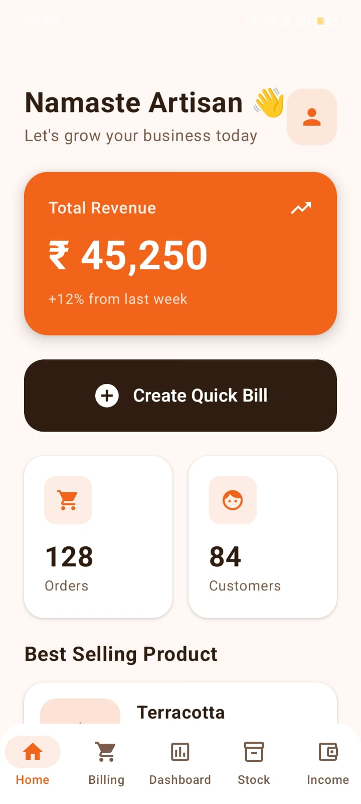
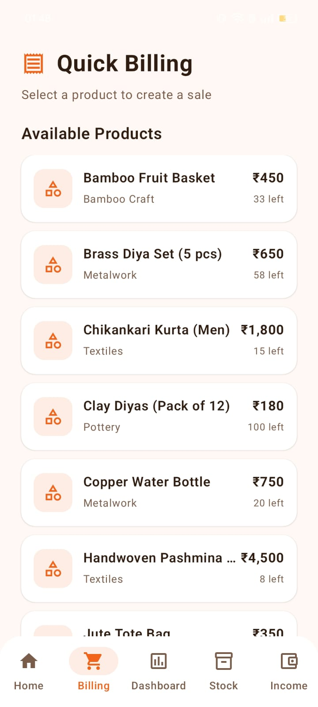
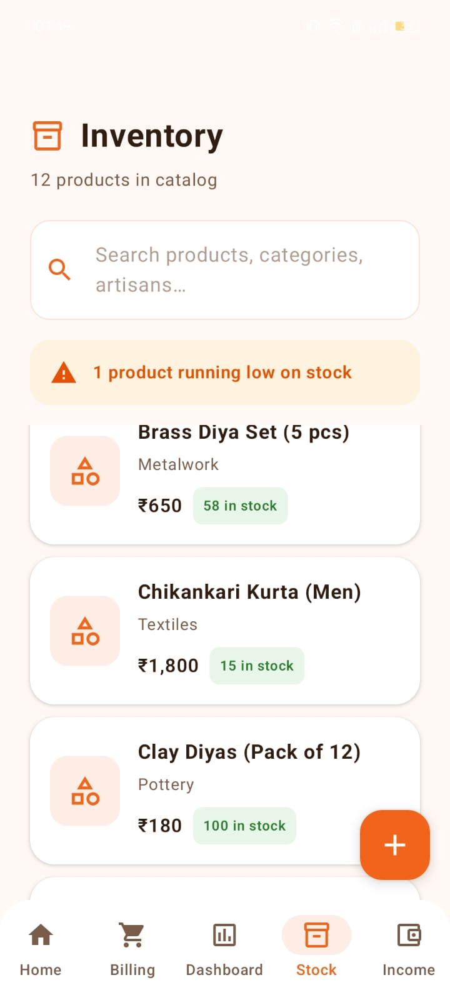

# 🛍️ HastaKala AI Shop Management

<p align="center">
  <b>AI-powered Android application for artisan business management, smart billing, analytics, and inventory tracking.</b>
</p>

<p align="center">
  Built using Kotlin • Jetpack Compose • Room Database • MVVM • Claude AI
</p>

---

# 📌 Overview

HastaKala Shop is a modern Android application designed to digitally empower artisan and handicraft businesses.

The app helps artisans manage:
- Inventory & stock
- Daily billing
- Revenue tracking
- Product analytics
- Business insights using AI

Unlike traditional manual bookkeeping methods, HastaKala provides a smart, modern, offline-first mobile solution with real-time analytics and AI-powered recommendations.

---

# ✨ Features

## 🏠 Smart Home Dashboard
- Artisan business overview
- Daily operational summary
- Best-selling product highlights
- Quick billing access

---

## 🧾 Smart Billing System
- Instant bill generation
- Product quantity selection
- Automatic stock deduction
- Real-time revenue updates
- Live dashboard synchronization

---

## 📦 Inventory Management
- Add new artisan products
- Search & filter inventory
- Low stock detection
- Product categorization
- Dynamic inventory updates

---

## 📊 Analytics Dashboard
- Revenue analytics
- Weekly sales visualization
- Category-wise analytics
- Best-selling product tracking
- Business performance insights

---

## 🤖 AI Business Insights
Integrated Claude AI to generate:
- Business recommendations
- Sales trend analysis
- Product performance insights
- Inventory suggestions
- Revenue observations

> The application gracefully falls back to local analytics if the AI API is unavailable.

---

## 💰 Income Tracking
- Sales history
- Revenue monitoring
- Transaction summaries
- Business activity tracking

---

# 📱 Application Screenshots

## 🏠 Home Screen

<p align="center">
  
</p>

---

## 🧾 Billing System

<p align="center">
  
</p>

---

## 📊 Dashboard Analytics

<p align="center">
  
</p>

---

## 📦 Inventory Management

<p align="center">
  
</p>

---

# 🏗️ Architecture

The project follows **MVVM Architecture** for scalability and clean separation of concerns.

```text
UI Layer (Jetpack Compose)
↓
ViewModel Layer
↓
Repository Layer
↓
Room Database
```

---

# 🛠️ Tech Stack

| Technology | Purpose |
|---|---|
| Kotlin | Android development |
| Jetpack Compose | Modern declarative UI |
| Room Database | Offline local storage |
| MVVM Architecture | Clean architecture |
| Kotlin Coroutines | Async operations |
| Flow & StateFlow | Reactive state management |
| Navigation Compose | Screen navigation |
| MPAndroidChart | Analytics visualization |
| Claude AI API | AI-generated business insights |
| KSP | Room code generation |
| OkHttp | API networking |

---

# 📂 Project Structure

```text
com.hastakala.shop/
│
├── data/
│   ├── db/
│   ├── model/
│   └── repository/
│
├── network/
│
├── ui/
│   ├── components/
│   ├── navigation/
│   ├── screens/
│   └── viewmodel/
│
├── utils/
│
├── HastaKalaApplication.kt
└── MainActivity.kt
```

---

# 🚀 Getting Started

## Prerequisites

Before running the project, ensure you have:

- Android Studio
- Android SDK 26+
- Kotlin support enabled
- Git installed

---

# ⚙️ Installation

## 1️⃣ Clone Repository

```bash
git clone https://github.com/YOUR_USERNAME/HastaKala-AI-Shop-Management.git
```

---

## 2️⃣ Open in Android Studio

Open the project folder inside Android Studio.

---

## 3️⃣ Add API Key 

Inside:

```text
local.properties
```

Add:

```properties
CLAUDE_API_KEY=your_api_key_here
```

---

## 4️⃣ Sync Gradle

Allow Android Studio to download dependencies and sync the project.

---

## 5️⃣ Run Application

Connect Android device/emulator and run:

```text
Run → Run 'app'
```

---

# 🧠 Key Concepts Used

## Room Database
Used for:
- product storage
- sales tracking
- local offline persistence

---

## KSP (Kotlin Symbol Processing)
Used for automatic Room database code generation.

Why KSP?
- Faster than kapt
- Modern Android approach
- Improved build performance

---

## StateFlow + Flow
Used for:
- reactive UI updates
- real-time dashboard updates
- live filtering/searching

---

## MVVM Architecture
Separates:
- UI
- business logic
- data layer

Benefits:
- scalability
- maintainability
- cleaner architecture

---

# ⚠️ Challenges Faced

## Room + KSP Compatibility
Resolved Gradle/KSP compatibility issues while integrating Room database.

---

## Adaptive Icon XML Errors
Fixed Android resource parsing and launcher icon XML conflicts.

---

## Reactive Dashboard Synchronization
Implemented live analytics updates using Flow + StateFlow.

---

## AI Fallback Design
Designed graceful fallback analytics when Claude AI is unavailable.

---

# 📚 Learning Outcomes

- Android app architecture
- Jetpack Compose UI development
- Room Database integration
- API integration
- Reactive state management
- Git & GitHub workflow
- Gradle debugging
- Android resource handling
- Real-world app deployment

---

# 🔮 Future Improvements

- Firebase Authentication
- Cloud synchronization
- Multi-user support
- PDF invoice export
- Barcode scanning
- Online payments
- AI voice assistant

---

# 👨‍💻 Author

## Ruthvik J

Android & AI Developer

---

# ⭐ Project Status

✅ Completed  
✅ APK Generated  
✅ AI Integrated  
✅ GitHub Deployed

---

# 📄 License

This project is developed for educational and portfolio purposes.
